## Presentation Overview

1.  **A brief overview of the serology**
2.  **Current approaches for the analysis of antibody data**
3.  **The proposed modelling approach**
4.  **Application to malaria sero-epidemiology**
5.  **Summary**

------------------------------------------------------------------------

## Key definitions

::::: columns
::: {.column width="60%"}
-   **Antigen**\
    A molecule (often a protein or polysaccharide) from a pathogen that is recognized by the immune system and can trigger an immune response.

-   **Antibody**\
    A protein produced by B cells that specifically binds to an antigen, reflecting current or past exposure to the pathogen.
:::

::: {.column width="40%"}
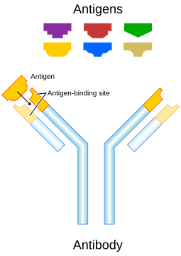{fig-align="center"}
:::
:::::

## Immune response to infectious diseases

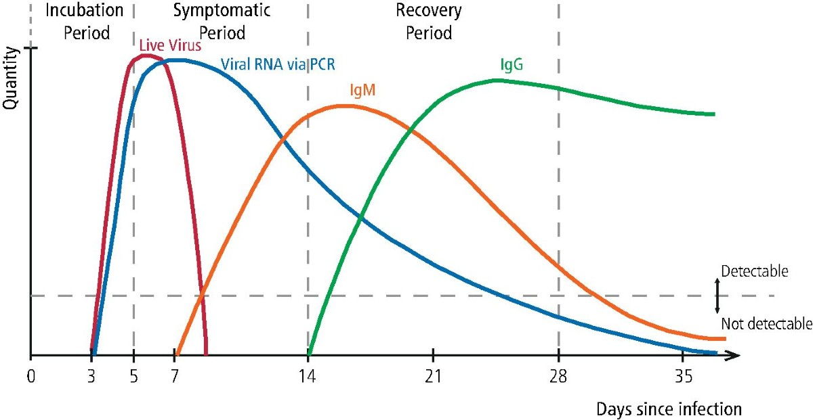{fig-align="center" out-width="90%"}

::: notes
Following infection, the adaptive immune response is initiated through antigen recognition by naïve B cells. Different classes of antibodies play distinct roles in this process. IgM is usually the first antibody produced following infection and reflects recent or ongoing exposure, but is short-lived. IgG is produced later, after immune maturation and class switching, and persists substantially longer, providing a durable marker of past exposure. Other antibody classes, such as IgA and IgE, play important biological roles but are less commonly used in sero-epidemiological studies.

The initiation of the adaptive immune response is not immediate, introducing a delay between pathogen entry and measurable antibody responses. During the incubation period, the pathogen replicates while innate immune mechanisms dominate early control. Antigen processing and presentation occur during this phase, and B-cell activation begins, but IgG antibodies are typically not yet detectable, creating a systematic lag between infection onset and serological evidence of exposure.

As infection progresses into the early symptomatic phase, short-lived antibody classes, particularly IgM, start to rise. At the same time, class-switch recombination is initiated and IgG production begins, although IgG levels remain relatively low. For this reason, IgG-based assays often have limited sensitivity very early in the course of disease.

During the peak symptomatic phase, or shortly thereafter, antigen levels decline as immune control is established. Plasma cells produce increasing quantities of IgG, leading to a rapid rise in IgG levels, which typically peak around or shortly after symptom resolution. The timing and magnitude of this peak depend on pathogen characteristics, infection intensity, and host immune status.

In the recovery and convalescent phase, IgM wanes rapidly, while IgG declines much more slowly, often following an approximately exponential decay. Long-lived plasma cells and memory B cells maintain persistent IgG titres, which may remain detectable for months or years. Subsequent exposure or reinfection usually results in faster and stronger boosting of IgG, compared with the primary response.

Because of this delayed but durable behaviour, IgG provides an integrated record of infection history, rather than a snapshot of current infection. This makes IgG the most commonly measured antibody isotype in sero-epidemiology.
:::

::: footer
Denning DW, Kilcoyne A, Ucer C (2020). *Non-infectious status indicated by detectable IgG antibody to SARS-CoV-2*.\
**British Dental Journal**, 229:521–524. [Link to article](https://www.nature.com/articles/s41415-020-2228-9)
:::

## When are IgG responses informative?

::: {style="font-size:0.75em; line-height:1.15;"}
-   Infections with many **asymptomatic** cases\
    malaria, dengue, chikungunya, Zika

-   Acute infections with **short diagnostic windows**\
    SARS-CoV-2, influenza, yellow fever

-   Diseases with **repeated or cumulative exposure**\
    malaria, schistosomiasis, soil-transmitted helminths, onchocerciasis

-   **Chronic** infection or **elimination** settings\
    trachoma, lymphatic filariasis, onchocerciasis

-   [Not informative]{.underline} when **cell-mediated** immunity is dominant\
    tuberculosis, leishmaniasis
:::

::: notes
IgG responses are most informative in settings where infection history cannot be reliably reconstructed from clinical or diagnostic data alone.

Infections with a high proportion of asymptomatic or mildly symptomatic cases, such as malaria, dengue, chikungunya and Zika, are poorly captured by routine surveillance. In these contexts, IgG provides a cumulative record of past exposure at both individual and population levels.

IgG is also valuable for acute infections with short diagnostic windows, such as SARS-CoV-2, influenza and yellow fever, where molecular or antigen-based detection is only possible for a limited period. Persisting IgG allows retrospective assessment of transmission.

Diseases characterised by repeated or ongoing exposure, such as malaria, schistosomiasis, soil-transmitted helminths and onchocerciasis, are another important application. Here, IgG levels integrate multiple infection events and can be informative about long-term transmission intensity rather than single episodes.

IgG responses are also widely used in chronic infections and in elimination or near-elimination settings, such as trachoma and lymphatic filariasis, where clinical cases become rare but evidence of residual transmission is still required.

However, there are important contexts where IgG is less informative. For infections that induce weak or short-lived systemic antibody responses, particularly some enteric bacterial infections such as cholera or non-typhoidal Salmonella, IgG levels may not reliably reflect exposure.

IgG is also less informative for diseases in which immunity is primarily cell-mediated rather than antibody-mediated, or where circulating IgG does not correlate well with protection or recent transmission, limiting its interpretability without additional modelling.

In interpreting serological data, it is useful to contrast antibody-mediated and cell-mediated immunity. Antibody-mediated, or humoral, immunity is driven by circulating antibodies such as IgM and IgG, which target pathogens or antigens present in the blood or other extracellular spaces. For this reason, antibody responses are particularly useful for population surveillance, for reconstructing exposure history, and for epidemiological inference based on serology. By contrast, cell-mediated immunity acts primarily through T cells that recognise and destroy infected host cells. In diseases where immune control relies predominantly on these cellular mechanisms, circulating antibody levels may provide only limited information about infection status or protection, and are therefore often poorly captured by serology alone.
:::

## Seropositivity and seronegativity {.smaller}

::: {style="font-size:1em; line-height:1.15;"}
-   **Seronegativity**\
    Absence of detectable antibody response to a given antigen.

-   **Seropositivity**\
    Antibody concentration exceeding a predefined assay-specific threshold, interpreted as evidence of prior exposure or immunity.

**Common approaches to serostatus classification**

-   Manufacturer-defined assay cut-offs\
-   Thresholds based on negative controls\
    (e.g. mean $+$ 2 or 3 SDs)\
-   ROC-based cut-offs using known positive/negative samples\
-   Immunological correlates of protection (when available)\
-   Data-driven thresholds via finite mixture models
:::

::: notes
Here I want to briefly clarify what we mean by seropositivity and how it is typically defined in practice.

The most common approach relies on **manufacturer-provided cut-offs**, which are often derived under laboratory conditions and may not translate well to field settings or different epidemiological contexts.

Another widely used method is based on **negative controls**, for example defining seropositivity as antibody levels exceeding the mean of a presumed negative population by two or three standard deviations. This is simple and reproducible, but it depends critically on having a truly unexposed reference group, which is often difficult to identify.

When well-characterised positive and negative samples are available, researchers sometimes use **ROC curve analysis** to choose a cut-off that optimises sensitivity and specificity. This approach is statistically principled, but again depends on the availability and representativeness of validation samples. (ROC-based cut-offs require reference samples with assumed known status. Positive samples usually come from PCR- or clinically confirmed cases, often biased toward recent or symptomatic infections. Negative samples typically come from presumed unexposed populations, such as blood donors from non-endemic areas or historical sera. A threshold is then chosen to balance sensitivity and specificity along the ROC curve. The limitation is that these reference samples are rarely representative of the full immune spectrum in endemic settings, so ROC cut-offs often fail to capture intermediate or waning antibody responses.)

In a few settings, **immunological correlates of protection** are available, meaning that a specific antibody level is known to be associated with clinical protection. These thresholds are biologically meaningful, but they are rare and pathogen-specific.

Finally, many sero-epidemiological studies rely on **finite mixture models**, most commonly Gaussian mixtures, to estimate a data-driven threshold separating seronegative and seropositive subpopulations. This is the approach we focus on next, and it motivates the modelling framework introduced in the following slides.
:::

## Antibody data and mixtures {.smaller}

::: {style="font-size:0.9em; line-height:1.15;"}
-   Quantitative antibody concentration $Y_i$ (e.g. OD values)\
-   Classical approach: two-component Gaussian mixture\
-   Seronegative vs seropositive components

$$
f(y) = \pi_0 \mathcal{N}(y ; \mu_0, \sigma_0^2) 
     + \pi_1 \mathcal{N}(y ; \mu_1, \sigma_1^2),
\quad \pi_0 + \pi_1 = 1
$$

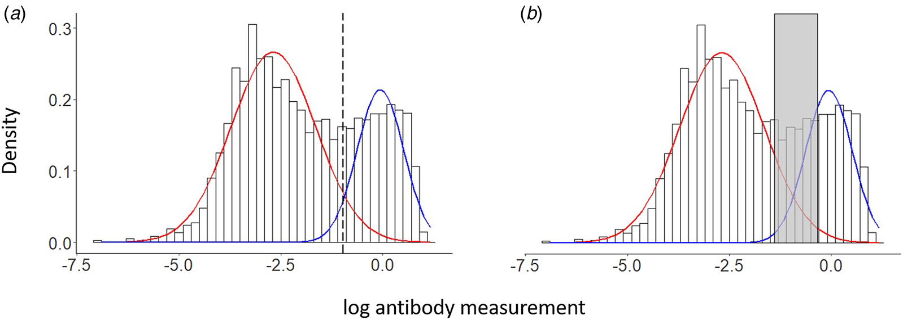{width="85%"}
:::

------------------------------------------------------------------------

## A latent variable of sero-reactivity

:::: {style="font-size:0.65em; line-height:1.15; max-height:650px; overflow-y:auto; padding-right:10px;"}
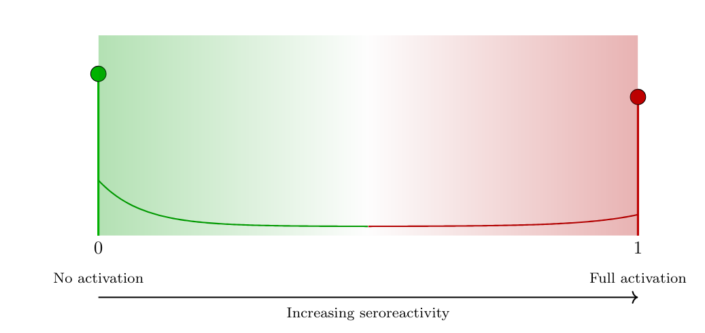{width="55%," fig-align="center"}

-   **Sero-reactivity**\
    The presence or degree of antibody reactivity, irrespective of any diagnostic threshold.

::: incremental
-   Latent variable $T \in [0,1]$ represents the underlying serological activation state:
    -   $T=0$: minimal or absent serological activity\
    -   $T=1$: strong or saturated antibody response
-   Antibody level given latent seroreactivity: $$
    Y \mid T=t \sim 
    \mathcal{N}\!\big( (1-t)\mu_0 + t\mu_1,\;
                     (1-t)\sigma_0^2 + t\sigma_1^2 \big)
    $$
    -   $\mu_0$: baseline (no activation)\
    -   $\mu_1$: saturation level\
    -   $\sigma_0^2, \sigma_1^2$: heterogeneity at the two extremes
:::
::::

## Link with antibody acquisition models {.smaller}

::: incremental
-   Classical antibody acquisition model\
    ([Yman et al., 2016](https://www.nature.com/articles/srep19472)) $$
    \mathbb{E}[Y;a] = f(a) = \mu_0 + (\mu_1 - \mu_0)\{1 - \exp(-r a)\},
    $$ with age $a$ and acquisition rate $r > 0$.

-   Interpretation in the latent sero-reactivity framework $$
    \mathbb{E}[T;a] = \frac{f(a)-\mu_0}{\mu_1-\mu_0}
          = 1 - \exp(-r a),
    $$

-   Resulting expectation of the antibody level $$
    \mathbb{E}[Y;a] = \mu_0 + (\mu_1-\mu_0)\,\mathbb{E}[T;a].
    $$
:::

## Alternative latent model formulations (1) {.smaller}
::: incremental

- Model: $Y \mid T=t = (1-t)Y_0 + tY_1$,  
  $Y_0 \sim \mathcal{N}(\mu_0,\sigma_0^2),\; Y_1 \sim \mathcal{N}(\mu_1,\sigma_1^2)$
- Mean: $\mathbb{E}(Y\mid T=t)=(1-t)\mu_0+t\mu_1$
- Variance: ${\rm Var}(Y\mid T=t)=(1-t)^2\sigma_0^2+t^2\sigma_1^2$
  - Quadratic; minimum at $t^*=\sigma_0^2/(\sigma_0^2+\sigma_1^2)$ → **U‑shape**
- Implications:
  - Lowest variability at intermediate $t$ (implausible for serology)
  - Retains two latent outcome mechanisms → **binary flavor**
  - With $\sigma_1^2<\sigma_0^2$, our linear interpolation gives **monotone decreasing** variance

:::
---

## Alternative latent model formulations (2) {.smaller}
::: incremental

- Model: $Y \mid T=t=(1-Z_t)Y_0+Z_tY_1,\; Z_t\sim{\rm Bernoulli}(t)$
- Variance:
  $$
  {\rm Var}(Y\mid T=t)=(1-t)\sigma_0^2+t\sigma_1^2+t(1-t)(\mu_1-\mu_0)^2
  $$
  - Extra **between‑component** term, maximized at $t=0.5$
- Implications:
  - Equivalent to a **GMM conditional on $t$**
  - **Probabilistic binary assignment** (low/high) persists
  - Does not capture a continuous immune activation spectrum

:::

## How do we model the latent variable $T$ ? {.smaller}

:::: incremental
::: {style="font-size:1em; line-height:1.15;"}
-   **Single-density approach**\
    The latent sero-reactivity $T \in [0,1]$ is modelled using a single parametric distribution: $$
    T \sim \text{Beta}(\alpha,\beta),
    $$ where $(\alpha,\beta)$ control the mean level of sero-reactivity and its heterogeneity.
-   **Mixture-distribution approach**\
    The latent variable $T$ is modelled as a three-component mixture capturing graded serological states: $$
    T \sim \pi_0\,\text{Beta}(\alpha_0,\beta_0)
       + \pi_1\,\text{Beta}(\alpha_1,\beta_1)
       + \pi_2\,\text{Beta}(\alpha_2,\beta_2),
    $$ with $\pi_k \ge 0$, $\sum_{k=0}^2 \pi_k = 1$, representing low, intermediate, and high sero-reactivity.
:::
::::

## Single Beta model for $T$ {.smaller}

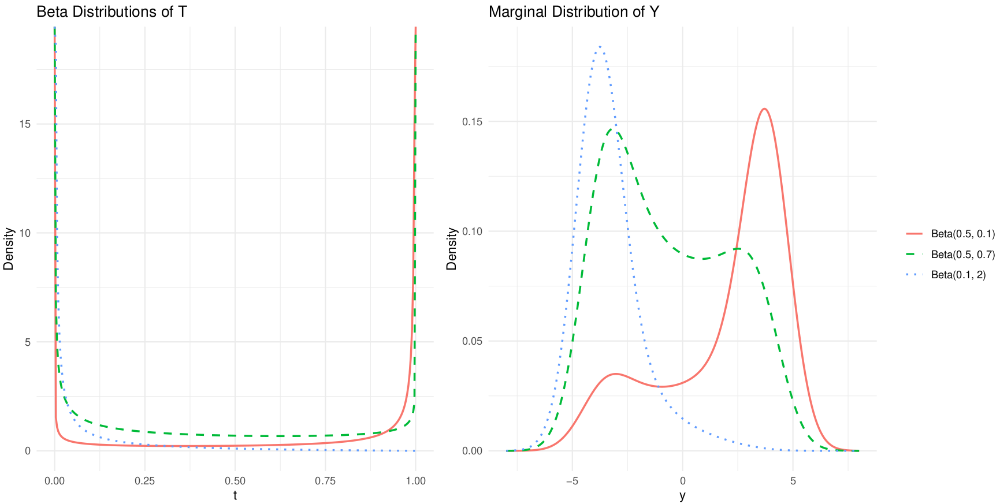{fig-align="center" width="70%"}

## Inference {.smaller}

::: {style="font-size:0.8em; line-height:1.15; max-height:650px; overflow-y:auto; padding-right:10px;"}
-   Two complementary inference approaches are used:

    (i) full maximum likelihood, and\
    (ii) a fast histogram-based approximation for exploratory fitting and initialisation.

-   Conditional on the latent immune state $T$, antibody concentrations are Gaussian with mean and variance interpolating between low and high sero-reactivity extremes.\
    The marginal density of $Y$ is obtained by integrating out $T$: $$
    f(y;\boldsymbol\theta,\boldsymbol\psi)=\int_0^1 
    \phi\!\left(y;(1-t)\mu_0+t\mu_1,(1-t)\sigma_0^2+t\sigma_1^2\right)
    \,g_T(t;\boldsymbol\psi)\,dt.
    $$

-   Exact maximum likelihood is based on $$
    \ell(\boldsymbol\theta,\boldsymbol\psi)=\sum_{i=1}^n\log f(y_i;\boldsymbol\theta,\boldsymbol\psi),
    $$ but direct maximisation is computationally intensive due to repeated numerical integration.
:::

## A computationally efficient $L_2$-based estimator {.smaller}
::: {style="font-size:1.1em; line-height:1.15; max-height:650px; overflow-y:auto; padding-right:10px;"}
-   To reduce computation, data are summarised into a histogram.\
    Let $\widehat f_j = n_j/(n\Delta_j)$ be the empirical density in bin $j$, and approximate model probabilities by evaluation at bin midpoints: $$
    p_j(\boldsymbol\theta,\boldsymbol\psi)\approx f(m_j;\boldsymbol\theta,\boldsymbol\psi)\Delta_j.
    $$

-   Parameters are estimated by minimising an $L_2$ distance between empirical and model densities: $$
    Q(\boldsymbol\theta,\boldsymbol\psi)=\sum_{j=1}^J\{\widehat f_j-f(m_j;\boldsymbol\theta,\boldsymbol\psi)\}^2.
    $$ This yields a robust minimum-distance estimator and is computationally efficient when $J\ll n$.
    
-   **Theorem.** Under regularity conditions, the $L_2$-based estimator converges in probability to the true $(\boldsymbol\theta, \boldsymbol\psi)$.

:::

## How do we model age dependency in $T$? {.smaller}

:::: incremental
::: {style="font-size:1.15em; line-height:1.15;"}
-   How should latent sero-reactivity $T$ change with age, reflecting cumulative exposure and immune maturation?
-   **Age-dependent structure**\
    Let the distribution of $T$ depend on age $a$ through parameters or mixing proportions, allowing gradual acquisition.
-   Application to **malaria**\
    Different antigens exhibit distinct age profiles of acquisition and boosting.
    -   AMA1\
        Rapid acquisition in early childhood, with sero-reactivity increasing quickly at young ages.
    -   MSP1\
        Slower and more gradual age-related increases, reflecting different exposure or immune dynamics.
:::
::::

::: notes
AMA1 and MSP1 are both blood-stage antigens of Plasmodium falciparum, but they differ in their immunological properties and in how antibody responses to them are acquired over age.

Antibodies to AMA1 tend to be acquired relatively quickly after exposure. Even limited exposure early in life often leads to detectable IgG responses, and antibody levels rise steeply with age during early childhood. This makes AMA1 a marker of recent or intense exposure, particularly sensitive to changes in transmission. However, AMA1 responses can also wane relatively quickly in the absence of continued exposure and are known to be boosted strongly by repeated infections.

By contrast, MSP1 antibody responses are typically acquired more gradually. Detectable IgG levels often increase slowly over childhood and adolescence, reflecting cumulative rather than recent exposure. MSP1 responses are therefore often more stable over time and less sensitive to short-term fluctuations in transmission intensity, making them a marker of long-term exposure history.

These differences mean that AMA1 and MSP1 encode different information about transmission. AMA1 is more informative about current or recent transmission, while MSP1 reflects accumulated past exposure. From a modelling perspective, this motivates allowing the age-dependence of latent sero-reactivity to differ by antigen, rather than assuming a common functional form across markers.

In our framework, this translates naturally into antigen-specific age effects on the latent variable T T, capturing faster acquisition for AMA1 and slower, more gradual accumulation for MSP1, without imposing hard sero-positivity thresholds.
:::

## AMA1: Model formulation (1) {.smaller}

::: incremental

**Latent variable for age $<\tau$:**

- Mixed discrete–continuous  
  $$
  f_T(t;a)=
  \begin{cases}
  1-\pi(a), & t=0,\\[4pt]
  \pi(a)\,\alpha_2\,t^{\alpha_2-1}, & 0<t<1,
  \end{cases}
  $$

- Probability of high sero-reactivity   
  $$
  \pi(a)=1-\exp(-\lambda a)
  $$

:::

---

## AMA1: Model formulation (2) {.smaller}

::: incremental

**Latent variable for age $\ge\tau$:**

- Latent variable distribution
  $$
  T\sim \mathrm{Beta}(\mu(a)\phi,\,[1-\mu(a)]\phi)
  $$

- Logit–linear regression  
  $$
  \mathrm{logit}\{\mu(a)\}=\eta_0+\eta_1\log(a)
  $$

- Continuity constraint at the change-point $\tau$  
  $$
  \eta_0=\mathrm{logit}(\mu_{\tau^-})-\eta_1\log(\tau)
  $$

- Mean of $T$ for $a < \tau$:  
  $$
  \mu_{\tau^-}
  =p_0 e^{-\tau\lambda}\frac{\alpha_1}{\alpha_1+\beta_1}
  +\bigl(1-p_0 e^{-\tau\lambda}\bigr)
   \frac{\alpha_2}{\alpha_2+\beta_2}
  $$

:::

---

## AMA1: Parameter estimates {.smaller}

| Parameter | Estimate | SD | 2.5% | 50% | 97.5% |
|-----------|---------:|---:|-----:|----:|------:|
| $\mu_0$ | -3.194 | 0.021 | -3.237 | -3.194 | -3.151 |
| $\mu_1$ | 0.747 | 0.010 | 0.727 | 0.747 | 0.768 |
| $\sigma_0$ | 0.745 | 0.013 | 0.719 | 0.745 | 0.772 |
| $\sigma_1$ | 0.091 | 0.013 | 0.062 | 0.091 | 0.117 |
| $\tau$ | 20.842 | 0.420 | 20.003 | 20.876 | 20.998 |
| $\alpha_2$ | 1.498 | 0.033 | 1.436 | 1.499 | 1.577 |
| $\lambda$ | 0.148 | 0.005 | 0.140 | 0.148 | 0.158 |
| $\phi$ | 4.544 | 0.131 | 4.298 | 4.551 | 4.828 |
| $\eta_1$ | -0.138 | 0.027 | -0.191 | -0.135 | -0.080 |

## AMA1 analysis: model-based histograms

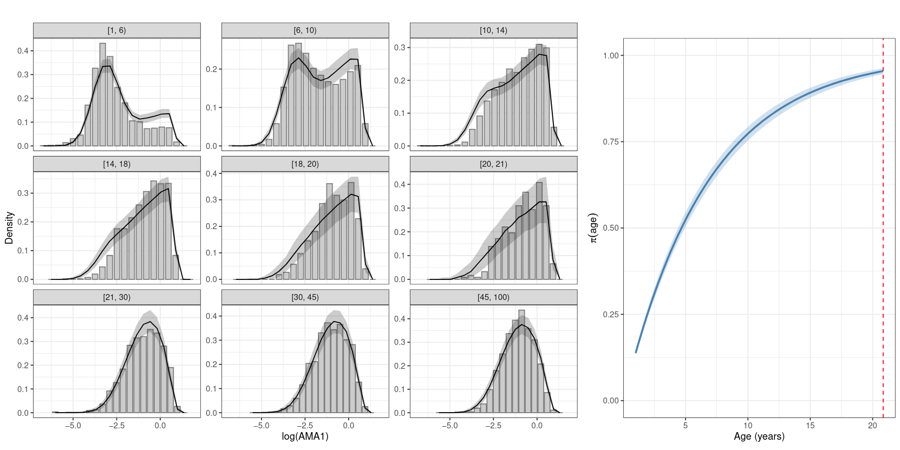{width="55%," fig-align="center"}

## MSP1: Model formulation {.smaller}

::: incremental

**Single‑component age‑dependent Beta distribution**

- Distribution of the latent variable
  $$
  T \sim \mathrm{Beta}(\alpha(a),\,\beta(a))
  $$
  where $\alpha(a)=\alpha_0\,a^{\gamma}$ and $\beta(a)=\beta_0\,a^{\delta(a)}$.

- Change point parameter
  $$
  \delta(a)=
  \begin{cases}
  \delta_1, & a\le \tau_{cp},\\[4pt]
  \delta_1+\delta_2, & a>\tau_{cp}. 
  \end{cases}
  $$

:::

---

## MSP1: Parameter estimates {.smaller}

| Parameter | Mean | SD | 2.5% | 50% | 97.5% |
|-----------|-----:|----:|------:|------:|--------:|
| $\mu_0$ | -4.481 | 0.042 | -4.567 | -4.479 | -4.404 |
| $\mu_1$ | 1.255 | 0.026 | 1.205 | 1.255 | 1.307 |
| $\log\sigma_0$ | -0.677 | 0.043 | -0.764 | -0.676 | -0.599 |
| $\log\sigma_1$ | -5.716 | 0.536 | -6.892 | -5.666 | -4.874 |
| $\alpha_0$ | 0.093 | 0.036 | 0.025 | 0.093 | 0.166 |
| $\gamma$ | 0.277 | 0.011 | 0.256 | 0.277 | 0.297 |
| $\beta_0$ | 0.755 | 0.037 | 0.684 | 0.754 | 0.827 |
| $\delta_1$ | 0.110 | 0.018 | 0.075 | 0.110 | 0.145 |
| $\tau_{cp}$ | 11.623 | 0.406 | 11.004 | 11.667 | 12.197 |
| $\delta_2$ | -0.061 | 0.010 | -0.080 | -0.061 | -0.042 |

## MSP1 analysis: results

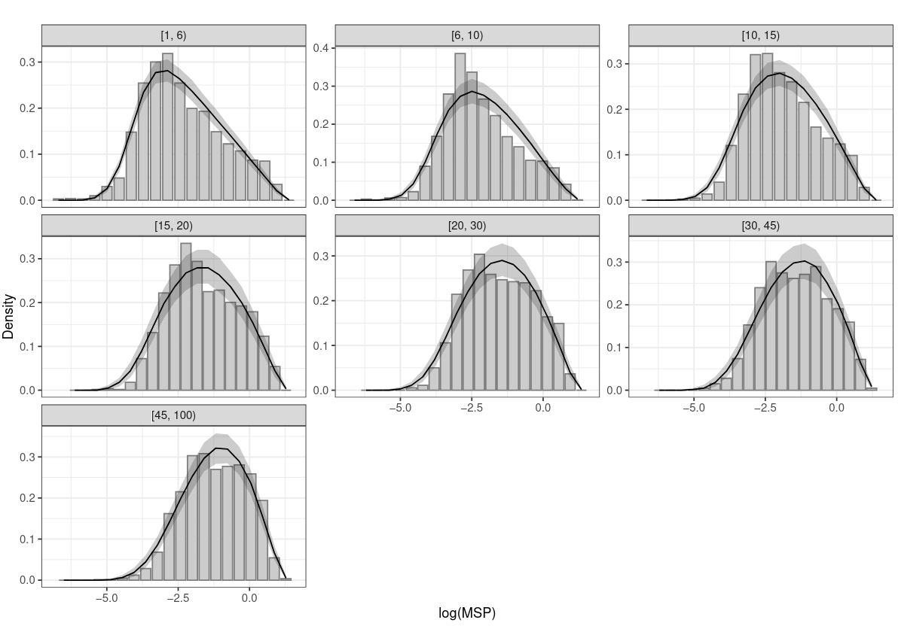{width="55%," fig-align="center"}

## Predicted antibody levels in AMA1
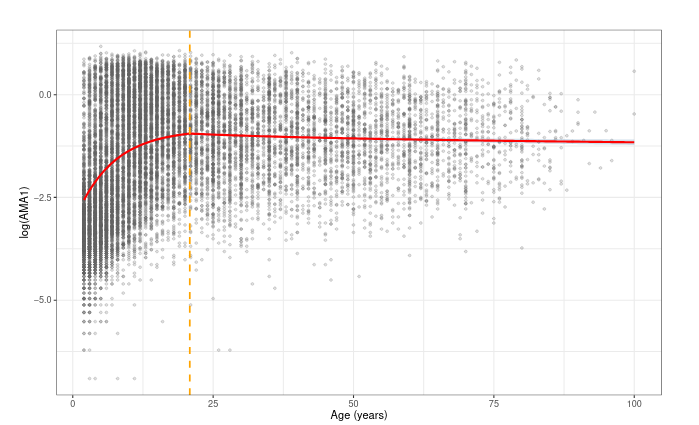

## Predicted antibody levels in MSP1
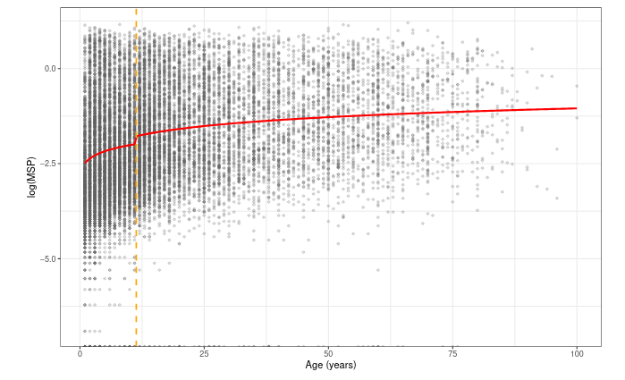

## Model comparison and computational cost {.smaller}
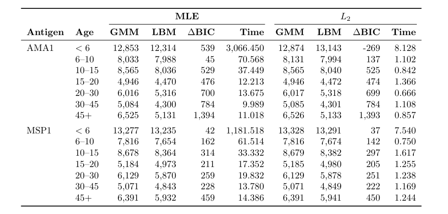

## Summary and conclusions {.smaller}

:::: {style="font-size:1.2em; line-height:1.15;"}
::: incremental
-   We proposed a latent-variable framework that [generalizes finite mixture models]{.underline}.
-   It allows [flexible age-dependent modelling.]{.underline}
-   Modelling of the latent variable (seroreactivity) can be done using [data-driven or mechanistic approaches]{.underline}.
-   We are working to extend the proposed model to
    -   analyse [geostatistical]{.underline} and [longitudinal]{.underline} data-sets;
    -   [jointly model]{.underline} multiple antibodies.
:::
::::

## THANK YOU! {.smaller}

{height="4in"}

🔗 [giorgistat.github.io](https://giorgistat.github.io)\
📧 e.giorgi\@bham.ac.uk\
📍 BESTEAM, Department of Applied Health Sciences, University of Birmingham

## Exploratory analysis: AMA1

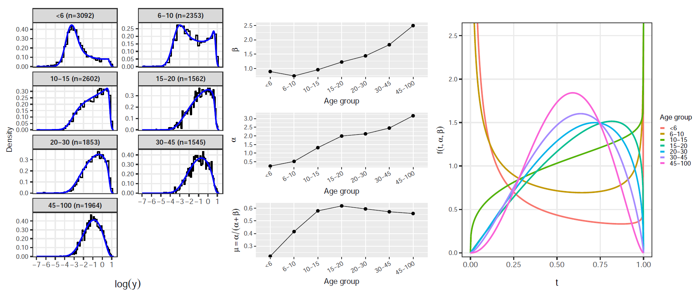{width="85%," fig-align="center"}

## Exploratory analysis: MSP1

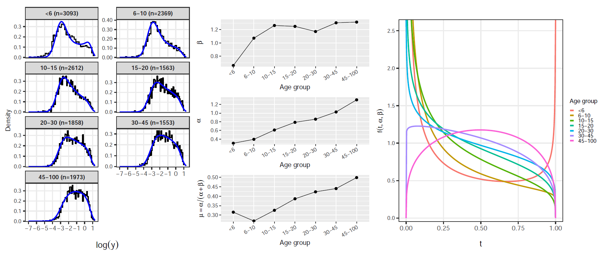{width="85%," fig-align="center"}

## Antibody measurement: How ELISA Works {.smaller}

<iframe src="https://www.youtube.com/embed/ERk0hwqhyDw" style="width:100%; height:65vh;" frameborder="0" allow="accelerometer; autoplay; clipboard-write; encrypted-media; gyroscope; picture-in-picture" allowfullscreen>

</iframe>
