## Presentation Overview

1.  **Neglected Tropical Diseases and Mass Drug Administration**
2.  **The standard geostatistical model for prevalence mapping**
3.  **A decay-adjusted spatio-temporal model**
4.  **Application to lymphatic filariasis in Madagascar**
5.  **Summary**

------------------------------------------------------------------------

## Neglected tropical diseases

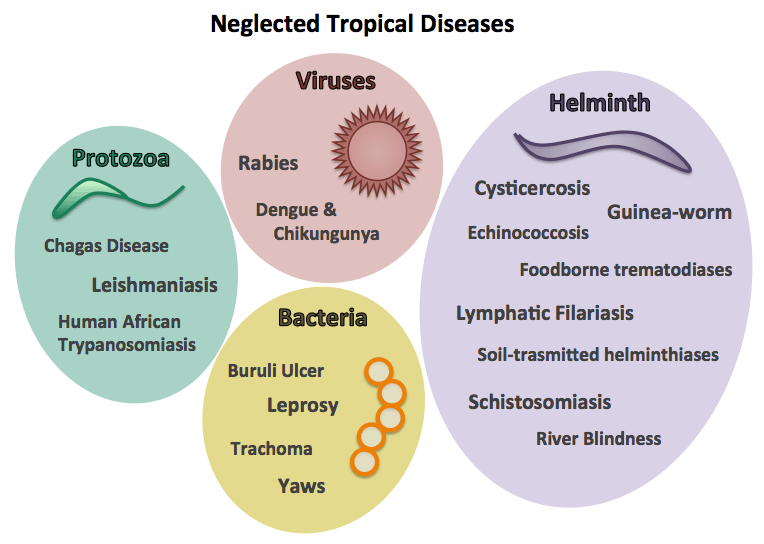

## NTD endemic areas

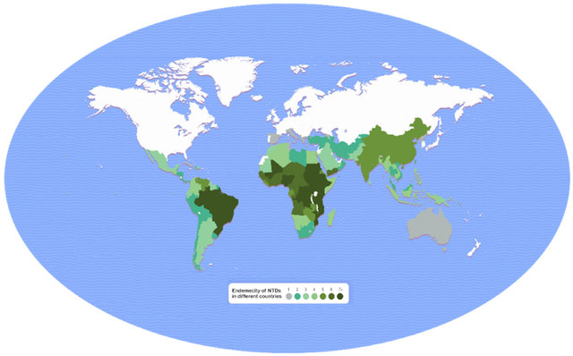

## The impact of NTDs

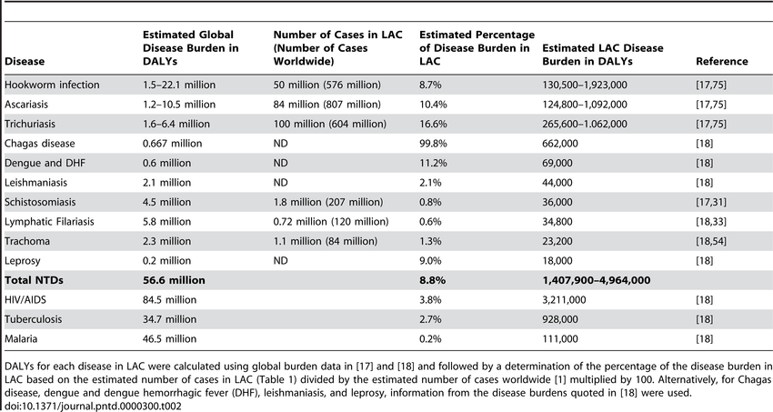{width="35%"}

## NTDs Risk Factors {.smaller}

::: {layout-ncol="2"}
{width="35%"}

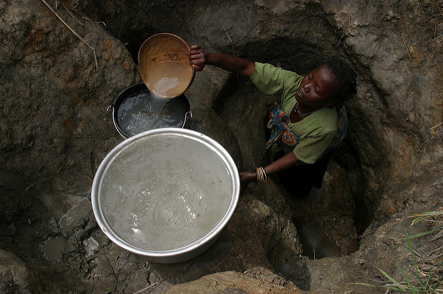{width="35%"}
:::

**Common risk factors:**\
- Poor sanitation and lack of clean water\
- Limited healthcare access\
- Poverty and overcrowding\
- Exposure to disease vectors (e.g., mosquitoes, flies)\
- Lack of education and awareness

## Mass Drug Administration (MDA): A Preventive Strategy {.smaller}

**What is MDA?** Mass Drug Administration involves the periodic distribution of safe, effective medications to **entire at-risk populations**—regardless of disease status—to reduce transmission and prevent infections.

. . .

**Why is it used?**

-   Controls or eliminates disease in endemic areas

-   Reduces the community-level parasite burden

-   Prevents long-term complications and disability

. . .

**Key Features:**

-   Delivered at regular intervals (annually or biannually)

-   Often combined with public health education

-   Supported by WHO and major global health initiatives

## Albendazole {.smaller}

:::::: {layout-ncol="2"}
::: {.column width="30%"}
{width="30%"}
:::

:::: {.column width="70%"}
**How it works:**\
Albendazole disrupts the metabolism of parasitic worms by inhibiting microtubule formation, which is essential for their survival.

::: notes
Albendazole works by stopping worms from absorbing the nutrients they need to survive. It blocks a process inside their cells that’s kind of like the framework or "skeleton" that helps them function and grow. Without it, the worms can't live for long and are eventually cleared from the body.
:::

**Used for NTDs such as:**

-   Lymphatic filariasis (in combination with ivermectin or DEC)

-   Soil-transmitted helminths (e.g., ascariasis, hookworm, trichuriasis)

**MDA use:**\
Distributed in large-scale deworming campaigns, particularly targeting children and at-risk communities.
::::
::::::

## Ivermectin {.smaller}

:::::: {layout-ncol="2"}
::: {.column width="30%"}
{width="30%"}
:::

:::: {.column width="70%"}
**How it works:**

Ivermectin paralyzes and kills parasites by interfering with their nerve and muscle function via chloride channel disruption. Parasites cannot move and feed.

::: notes
**Ivermectin kills parasites by messing with their nerves and muscles, which causes them to become paralyzed and die.** It stops them from moving and feeding, so the body can get rid of them.

Chloride channel disruption refers to any impairment in the normal function of chloride channels, which are protein pores in cell membranes that allow chloride ions (Cl-) to pass through.
:::

**Used for NTDs such as:**

-   Onchocerciasis (river blindness)\

-   Lymphatic filariasis (in combination with albendazole)\

-   Strongyloidiasis

**MDA use:** Ivermectin is given to both adults and children (weighing more than 15kg), but its use is carefully considered for pregnant women.
::::
::::::

## Praziquantel {.smaller}

:::::: {layout-ncol="2"}
::: {.column width="30%"}
{width="30%"}
:::

:::: {.column width="70%"}
**How it works:**\
Praziquantel increases permeability of the parasite's cell membranes to calcium ions, causing muscle contraction and paralysis.

::: notes
Praziquantel makes the outer layer of the parasite’s cells more "leaky," allowing calcium to enter. This causes the parasite's muscles to tighten and paralyze it, making it easier for the body to get rid of it.

Inside the cells of parasites, calcium is important for controlling muscle movement. When calcium enters the parasite's cells (which normally isn't supposed to happen), it disrupts the normal function of the muscles.

This excess calcium makes the muscles contract and become stiff. The parasite can't move properly or feed, and it becomes paralyzed, which allows the body to get rid of it. So, calcium causes the parasite’s muscles to freeze up, stopping it from surviving or causing further harm.
:::

**Used for NTDs such as:**\

-   Schistosomiasis\

-   Tapeworm infections

**MDA use:**\
Key drug in school-based and community-wide treatment campaigns in regions with high schistosomiasis burden.
::::
::::::

## Treating NTDs {.smaller}

```{r}
#| echo: false
#| tbl-width: compact

ntd_treatments <- data.frame(
  Disease = c("STH", "Schisto", "LF", "Trachoma"),
  ALB = c("✓", "✓†", "✓†", ""),
  PZQ = c("", "✓", "", ""),
  IVM = c("", "", "✓", "✓‡"),
  AZM = c("", "", "", "✓"),
  DEC = c("", "", "✓", ""),
  MOX = c("", "", "✓", ""),
  Other = c("MBD", "OXA", "DOX*", "TEO")
)

knitr::kable(ntd_treatments, align = "c", 
             col.names = c("Disease", "Alb", "PZQ", "IVM", "AZM", "DEC", "MOX", "Other")) |>
  kableExtra::kable_styling(
    full_width = FALSE,
    font_size = 27,
    latex_options = "scale_down"
  )
```

**Abbreviations:**

Alb = Albendazole, PZQ = Praziquantel, IVM = Ivermectin, AZM = Azithromycin, DEC = Diethylcarbamazine, MOX = Moxidectin, MBD = Mebendazole, OXA = Oxamniquine, DOX = Doxycycline, TEO = Tetracycline eye ointment

**Symbols:**

† Used in combination therapy

‡ Only in onchocerciasis co-endemic areas

\*Adjunctive treatment

::: notes
**Key Explanations:** - **combo**: Combination therapy enhances efficacy (e.g., albendazole+praziquantel for schistosomiasis kills both juvenile and adult worms)

-   **co-endemic areas only** (trachoma/ivermectin):
    -   Ivermectin is only recommended for trachoma in areas where onchocerciasis (river blindness) is also present because:
        1.  **In onchocerciasis-endemic areas**: Mass ivermectin distribution is already occurring for river blindness control, so it can simultaneously help reduce trachoma transmission
        2.  **In non-onchocerciasis areas**:
            -   Azithromycin is preferred as the primary trachoma treatment because:
                -   It has direct antibacterial action against Chlamydia trachomatis
                -   Better safety profile for children and pregnant women
                -   Additional community-wide benefits against other bacterial infections
            -   Ivermectin isn't contraindicated, but simply less optimal than azithromycin for trachoma-specific control
-   **adjunct**:
    -   Secondary treatment that supports but doesn't replace primary therapy
    -   Example: Doxycycline for LF kills Wolbachia bacteria inside adult worms, making them sterile (used alongside albendazole/ivermectin)
:::

## Assessing MDA Impact {.smaller .scrollable}

**Timeframe for observable impact:**

-   STH: Reduced prevalence seen after 1-2 annual rounds

-   Schistosomiasis: Egg reduction visible after 1-2 years

-   LF: Microfilariae reduction within months, but breaking transmission requires 5+ years

-   Trachoma: Active disease reduction in 1-3 years

**Monitoring surveys:**

-   Baseline surveys (pre-MDA)

-   Transmission Assessment Surveys (TAS) for LF after 5+ rounds

-   Impact surveys (after 3-5 rounds)

-   Post-treatment surveillance (after reaching elimination targets)

**Key indicators:**

-   Parasitological prevalence (STH, schisto)

-   Antigenemia (LF)

-   TF/TI rates (trachoma)

-   Entomological indices (for vector-borne NTDs)

## Modelling the impact of MDA
<center>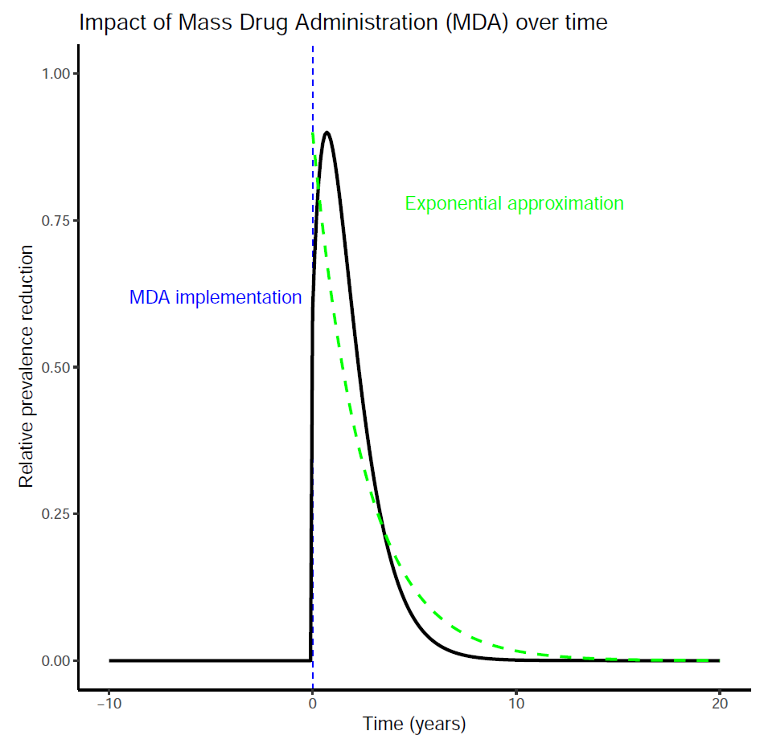{width="55%"}</center>


## The standard geostatistical model for prevalence mapping {.scrollable .smaller}

-   **Outcome**: $Y_i$ number of cases out $n_i$ sampled

. . .

-   **Locations**: $X = (x_1, \ldots, x_n)$

. . .

-   **Covariates** (optional): $d(x)$ (e.g. elevation, distance from waterways)

. . .

-   **Spatial Gaussian process**: $S(x)$ (stationary and isotropic) $$
    {\rm cov}\{S(x), S(x')\} = \sigma^2 \rho(||x - x'||; \phi)
    $$ Example: $\rho(u; \phi) = \exp\{-u/\phi\}$.

. . .

-   **Conditional independence**: $Y_{i}$ conditionally on $S(x_i)$ are mutually independent $Bin(n_i , p(x_i))$

. . .

-   The **linear predictor** $$
    \log\left\{\frac{p(x_i)}{1-p(x_i)}\right\} = \beta_0 + d(x_i)^\top \beta + S(x_i)
    $$

## Spatial and temporal confounding with MDA {.smaller}

<center>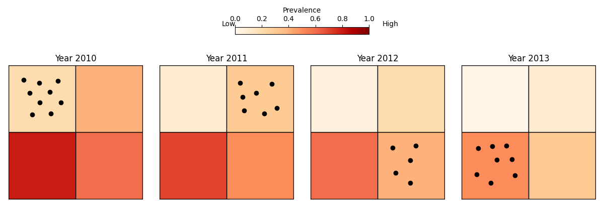</center>

**Issues:**

-   Areas with different levels of transmission are sampled at different times.

-   Use of MDA rounds can even show a positive associated with disease risk

## Modelling the Impact of MDA {.smaller}

We model observed prevalence $P(x,t)$ as a product of:

-   **Counterfactual prevalence**, $P^*(x,t)$, in the absence of MDA
-   A **cumulative MDA effect**, based on rounds of effective treatment

$$
P(x, t) = P^*(x, t)\prod_{j=1}^{r(t)} \left[1 - f(t - u_j)\right]^{I(x, u_j)}
$$

-   $u_j$: times of effective MDA rounds\
-   $I(x, u_j)$: indicator of MDA coverage at location $x$ and time $u_j$
-   $r(t)$ is the number of MDA rounds carried out before time $t$

## Parametric form of MDA decay function {.smaller}

$$
f(v) = \alpha \exp\left\{ -\left(\frac{v}{\gamma}\right)^{\kappa} \right\}
$$

-   $\alpha$: maximum reduction immediately after MDA\
-   $\gamma$: scale of decay\
-   $\kappa$: shape of decay (fixed)

<center>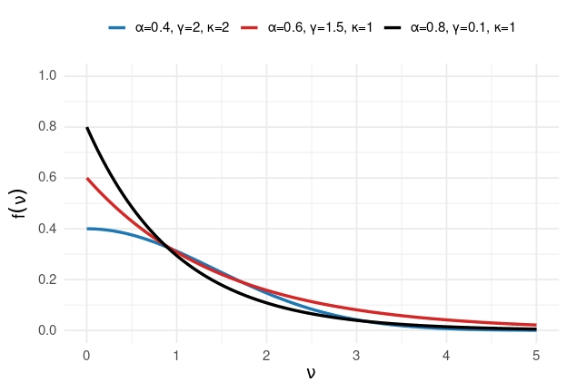{width="40%"}</center>

## Monte Carlo Maximum Likelihood {.smaller .scrollable}

-   Let $W_i = S(x_i) + Z_i$ and $W = (W_1, \ldots, W_n)$

. . .

-   The likelihood function for parameters $\theta = (\beta, \sigma^2, \phi, \tau^2)$ is given by:

    $$
    L(\theta) = \int N(W; D\beta, \Omega) f(y| W) dW
    $$

    where $\Omega = \sigma^2 R(\phi) + \tau^2I_n$.

. . .

-   We approximate this using Monte Carlo integration:

    $$
    L_m(\theta) = \frac{1}{B} \sum_{j=1}^{B} \frac{N\left(W^{(j)}; D\beta, \Omega \right)}{N\left(W^{(j)}; D\beta_0, \Omega_0\right)}
    $$ where $W^{(i)}$ are sampled from the distribution of $W$ given $y$ using an MCMC algorithm.

-   All implemented in the `dast` function of the `RiskMap` package 

## Applications

-   [Lymphatic filariasis in Madagascar](#lf-slide)

-   [Soil-transmitted helminths in Kenya](#sth-slide)

## Example: Lymphatic filariasis in Madagascar {#lf-slide}

<center>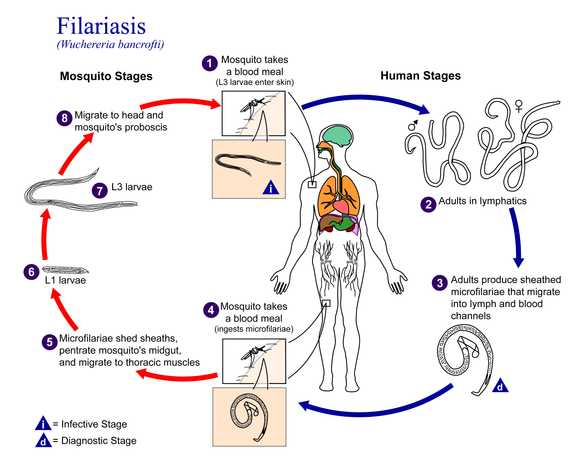{width="60%"}</center>

## The data

::: {style="width: 100%; height: 900px; position: relative;"}
<iframe src="lf_madagascar.html" width="100%" height="70%" style="border: none; position: absolute; top: 0; left: 0;">

</iframe>
:::

## Timeline of surveys and MDA

<center>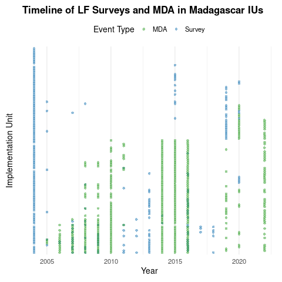{width="55%"}</center>

## Monotone likelihood for $\alpha$

<center>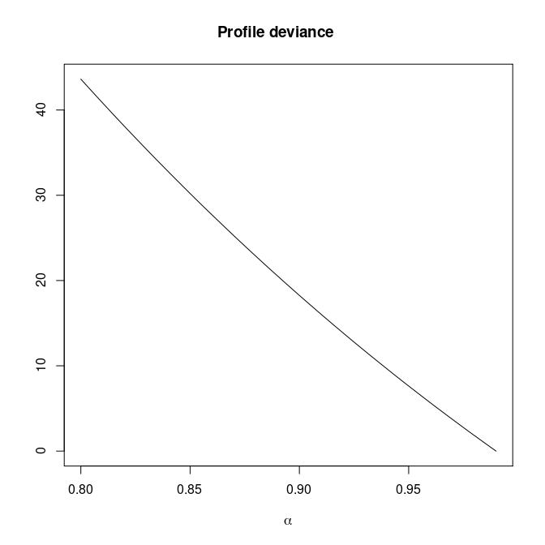{width="50%"}</center>

## Introducing penalization for $\alpha$ {.smaller .scrollable}

-   Let $p(\alpha) > 0$ be a positive function.

. . .

-   The penalized likelihood for $\alpha$ is $$
    L_{p}(\theta) = L(\theta) - p(\alpha)
    $$

. . .

-   Proposed penalty

    $$
    p(\alpha) = -\left[\lambda_1 \log\alpha + \lambda_2\log(1-\alpha) \right]
    $$

. . .

-   We set $\lambda_1 = 20$ and $\lambda_2 = 14$. (This inspired by a Beta distribution with mode in around 0.6, with 0.42 and 0.7 as its 0.025 and 0.975 quantiles, respectively.)

<center>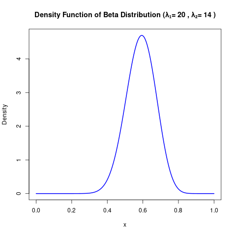{width="40%"}</center>

## Introducing penalization for $\alpha$ {.smaller}

<center>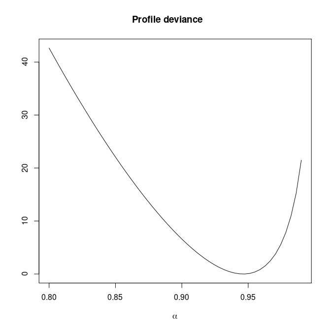{width="50%"}</center>

## Paramter estimates

MDA impact function: $f(v) = \alpha\exp\{-v/\gamma\}$, with $v$ denoting the years since last MDA

. . .

| Parameter                 | Estimates               |
|---------------------------|-------------------------|
| Intercept                 | -2.582 (-2.622, -2.541) |
| Spatial variance          | 2.204 (1.891, 2.569)    |
| Spatial scale             | 79.153 (70.874, 88.399) |
| Max. reduction ($\alpha$) | 0.856 (0.839, 0.872)    |
| Decay scale ($\gamma$)    | 1.802 (1.768, 1.837)    |

## Estimated MDA impact function

<center>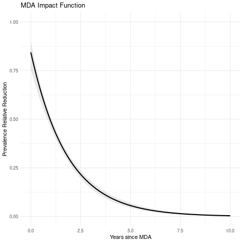</center>

## Prevalence prediction 2000-2024

<center>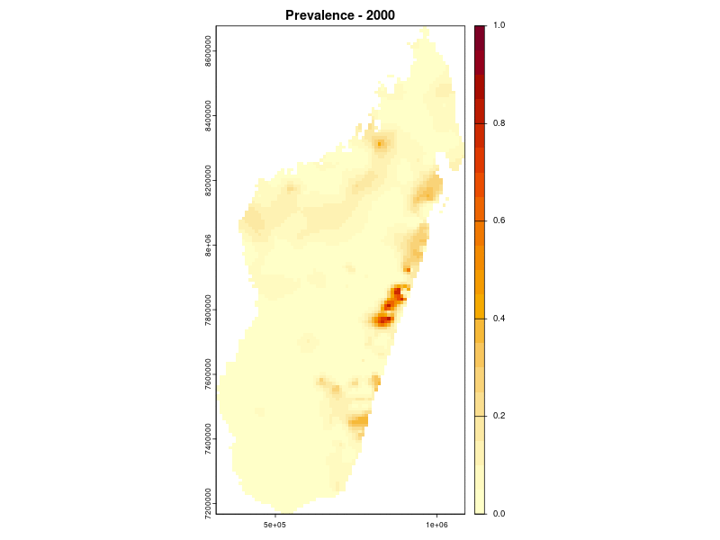</center>

## Example: soil-transmitted helminths in Kenya {#sth-slide}

<center>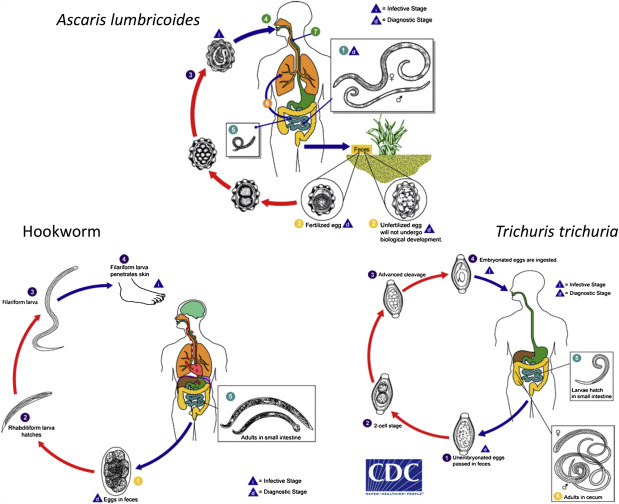</center>

## The data

::: {style="width: 100%; height: 900px; position: relative;"}
<iframe src="sth_kenya.html" width="100%" height="70%" style="border: none; position: absolute; top: 0; left: 0;">

</iframe>
:::

## Timeline of surveys and MDA

<center>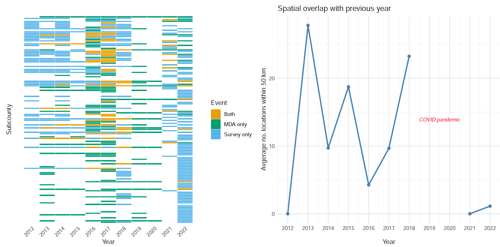{width="95%"}</center>

## Paramter estimates {.smaller}

MDA impact function: $f(v) = \alpha\exp\{-v/\gamma\}$, with $v$ denoting the years since last MDA


| Parameter | Ascaris | Trichuris | Hookworm |
|-----------|---------|-----------|----------|
| **Intercept** ($\beta$) | -2.432 (-2.478, -2.374) | -2.402 (-2.457, -2.336) | -1.960 (-2.012, -1.899) |
| **Spatial variance** ($\sigma^2$) | 22.975 (11.276, 56.275) | 36.665 (16.309, 90.619) | 32.760 (14.418, 86.624) |
| **Spatial scale** ($\phi$) | 214.303 (102.984, 522.853) | 221.500 (99.104, 583.012) | 293.396 (132.714, 844.706) |
| **Max. reduction** ($\alpha$) | 0.304 (0.256, 0.371) | 0.450 (0.352, 0.547) | 0.926 (0.853, 0.971) |
| **Decay scale** ($\gamma$) | 28.873 (12.254, 85.485) | 3.886 (2.788, 5.543) | 6.710 (4.774, 8.933) |


## The MDA impact by STH species

<center>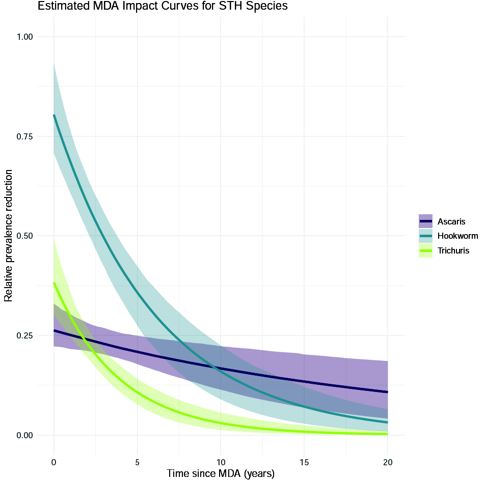{width="55%"}</center>

## Prevalence prediction 2012-2023

<center>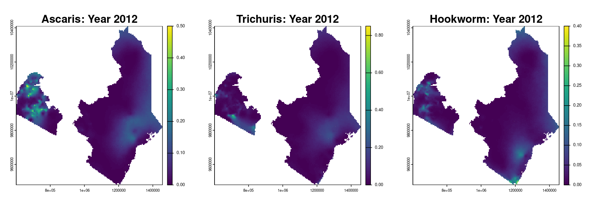{width="75%"}</center>

<center>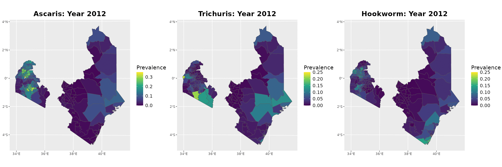{width="75%"}</center>

## Discussion {.smaller .scrollable}

**A1 — Baseline equilibrium:** Replace $S(x)$ with a spatio-temporal process $S(x,t)$ to capture background prevalence trends. Regularise $f(v)$ via informative priors or penalized likelihood to preserve identifiability of MDA effects.

. . .

**A2 — Transient MDA effect:** Allow partial permanence once prevalence drops below an elimination threshold $p^*$:
$$
f(x,t) = \alpha \left[(1 - r(x,t))\exp\left\{-\frac{t - t^*(x,t)}{\gamma}\right\} + \delta \times r(x,t)\right],
$$
where $r(x,t) = I\{P(x, t^-) < p^*\}$

. . .

**A3 — Constant relative reduction:** Allow $\alpha$ to vary with baseline prevalence $P^*(x)$ via a smooth function $h(\cdot)$, or a piecewise-constant specification across prevalence strata.

. . .

**Adherence:** Weight each MDA round by observed adherence $A(x,t) \in [0,1]$:
$$
P(x,t) = P^*(x)\prod_{j:\,u_j < t} \Big(1 - f(t-u_j)\Big)^{A(x, u_j)\, I(x, u_j)}
$$

. . .

**Age-varying effects:** Model $\alpha(a)$ and $\gamma(a)$ as smooth or piecewise functions of age.

. . .

**Multiple interventions:** Assign each intervention its own impact function $f_k$, with an interaction term $\psi_{k\ell}$ to capture synergy ($\psi_{k\ell}>0$) or antagonism ($\psi_{k\ell}<0$).


## THANK YOU! {.smaller}

<center>{height="4in"}</center>

🔗 [giorgistat.github.io](https://giorgistat.github.io)\
📧 e.giorgi\@bham.ac.uk\
📍 Department of Applied Health Sciences, University of Birmingham
