## Outline {.scrollable .smaller}

::: incremental
- **Part I.** One antigen: a continuous latent *seroreactivity* replaces seropositive / seronegative
- **Part II.** Two antigens: three principles for where dependence enters, and the spatial extension
:::

# Part I {background-color="#073642"}

## The dominant paradigm {.smaller .scrollable}

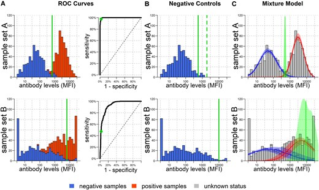

$$f(y) = \pi_0\, \mathcal{N}(y; \mu_0,\sigma_0^2) + \pi_1\, \mathcal{N}(y; \mu_1,\sigma_1^2)$$

::: incremental
- Individuals classified into two mutually exclusive states
- Which threshold to use?
- Choice should be context dependent
- Multiple antigens, multiple thresholds?
:::

::: {.r-fit-text}
White, Baudemont et al. (2026). *Whose Line Is it Anyway? Defining Seropositivity Cutoffs for Infectious Disease Surveillance*. JID. [doi.org/10.1093/infdis/jiaf537](https://doi.org/10.1093/infdis/jiaf537)
:::

## A threshold-free approach: Latent variable models 

::: incremental

**Seroreactivity**: degree of antibody reactivity, irrespective of any threshold.

Latent $T \in [0,1]$

-    $T \approx 0$: minimal activity
-    $T \approx 1$: saturated response
-    $Y \mid T=t \sim
\mathcal{N}\big( (1-t)\mu_0 + t\mu_1,\;
(1-t)\sigma_0^2 + t\sigma_1^2 \big)$

:::

## Modelling $T$: single distribution

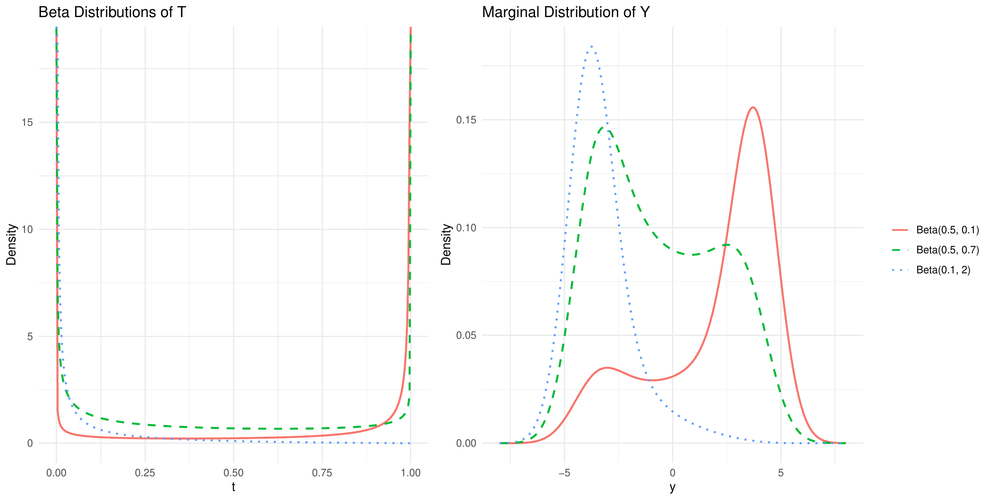{fig-align="center" width="70%"}

## Analogy: amount of DNA generated by a cell {.smaller .scrollable}

::::: columns
::: {.column width="50%"}
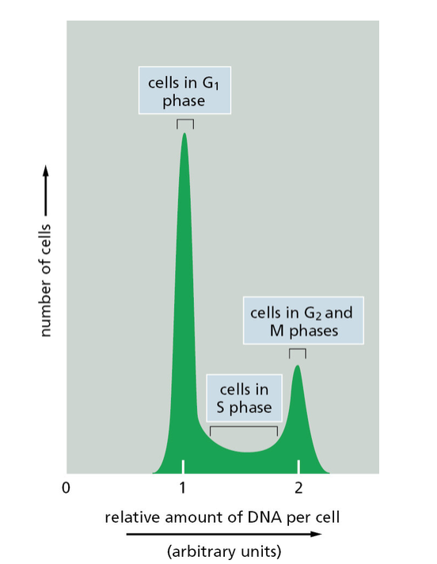{fig-align="center" width="80%"}
:::

::: {.column width="50%"}
::: incremental
- Mass piles up at two **boundary states**: 2n (pre-replication) and 4n (post-replication)
- Cells in S phase occupy a genuine **continuum** in between
:::

 

::: {.r-fit-text}
Taken from Alberts B, Johnson A, Lewis J, Morgan D, Raff M, Roberts K, Walter P (2015). *Molecular Biology of the Cell*, 6th edition. New York: Garland Science.
:::
:::
:::::

## Modelling $T$: mixtures

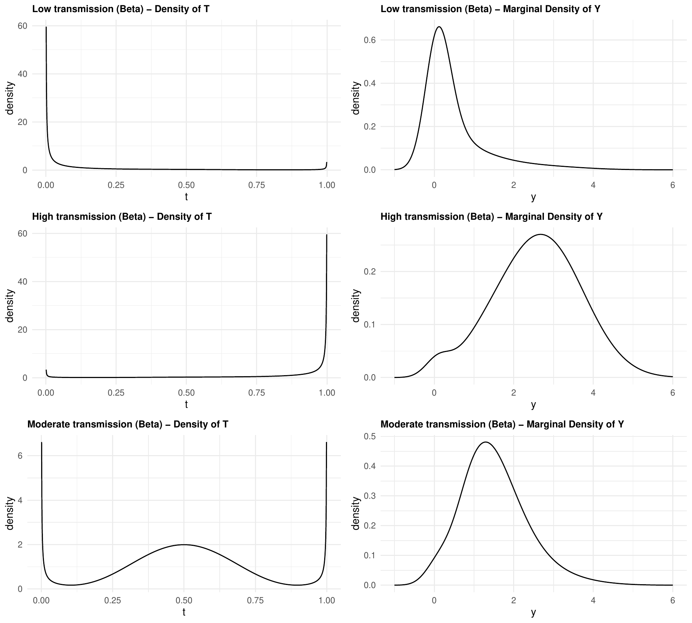{fig-align="center" width="78%"}

## Age dependency {.smaller .scrollable}

Recall the two ways of modelling $T$:

$$
1) \quad T \sim \text{Beta}(\alpha,\beta)
$$

$$
2) \quad T \sim \bigl(1-\pi(a)\bigr)\,\text{Beta}(t;\alpha_1,\beta_1) + \pi(a)\,\text{Beta}(t;\alpha_2,\beta_2)
$$

 

::: incremental
- **Through the shape**: $\alpha(a)=\alpha_0 a^{\gamma}$, $\beta(a)=\beta_0 a^{\delta}$

  the single Beta's own shape parameters vary with age

- **Through the mixing weights**: $\pi(a) = 1-\exp(-\lambda a)$

  age shifts weight from the low- to the high-seroreactivity component
:::

## Application: malaria, Kenyan highlands {.smaller .scrollable}

Rachuonyo South District, 2011 — IgG against **AMA1** and **MSP1** (Bousema et al., 2013, 2016).

Strategy: fix conditional parameters $(\mu_0,\mu_1,\sigma_0^2,\sigma_1^2)$ from the youngest age group, then re-estimate only $T$'s distribution within each successive age band.

## AMA1: age-stratified exploration {.smaller}

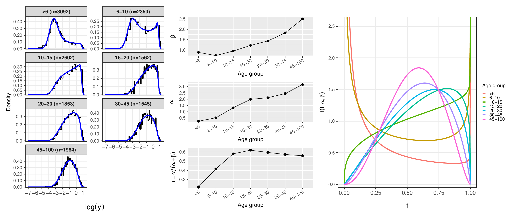{fig-align="center" width="100%"}

::: incremental
- Left: histograms and fitted densities by age band
- Middle: Beta shape parameters $\alpha$, $\beta$ and their mean across age
- Right: fitted Beta densities of $T$ by age band
:::

## AMA1: model specification {.smaller .scrollable}

A **change point** $\tau$ separates two regimes, with the mean of $T$ kept continuous across it.

**Below $\tau$** — mechanistic, with a degenerate mass at $T=0$:

$$
f_T(t;a) =
\begin{cases}
1-\pi(a), & t=0\\[4pt]
\pi(a)\,\alpha_2\, t^{\alpha_2-1}, & 0<t<1
\end{cases}
\qquad
\pi(a) = 1-\exp(-\lambda a)
$$

**Above $\tau$** — empirical Beta with logit-linear mean:

$$
T \sim \text{Beta}\big(\mu(a)\phi,\,[1-\mu(a)]\phi\big),
\qquad
\text{logit}\{\mu(a)\} = \eta_0 + \eta_1\log(a)
$$

::: incremental
- Continuity constraint: $\eta_0 = \text{logit}(\mu_{\tau^-}) - \eta_1\log(\tau)$
- $\hat\tau = 20.8$ years — mechanistic model appropriate up to about age 20
- $\hat\lambda = 0.148$ — roughly half of children have initiated a response by age 5
- $\hat\eta_1 < 0$ — modest decline in mean seroreactivity at older ages
:::

## AMA profile {.scrollable}

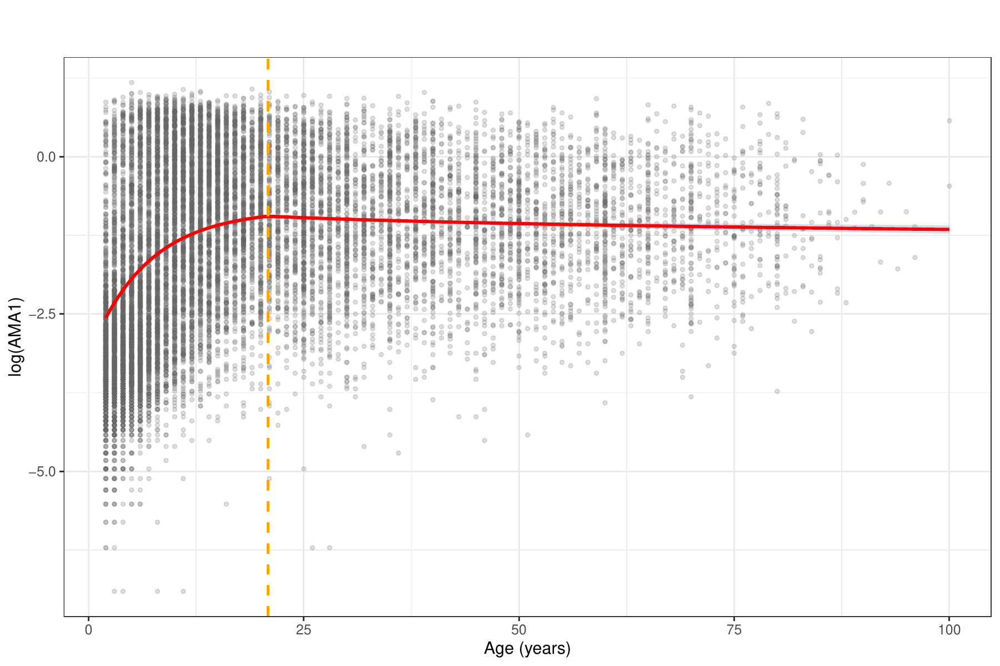{fig-align="center" width="58%"}

## AMA1: goodness of fit {.smaller .scrollable}

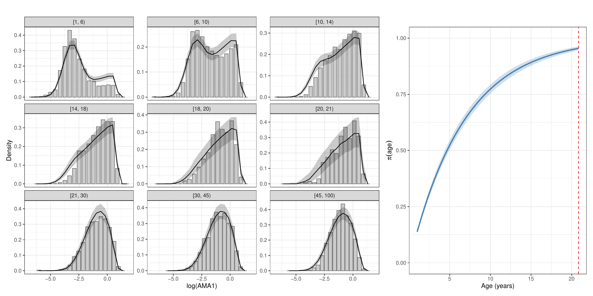{fig-align="center" width="80%"}

::: incremental
- Envelope of histograms simulated from the fitted model vs. the observed histogram
- Good agreement across most age bands
- Slight overstatement of high-antibody individuals in the youngest groups
:::

## MSP1: age-stratified exploration {.smaller}

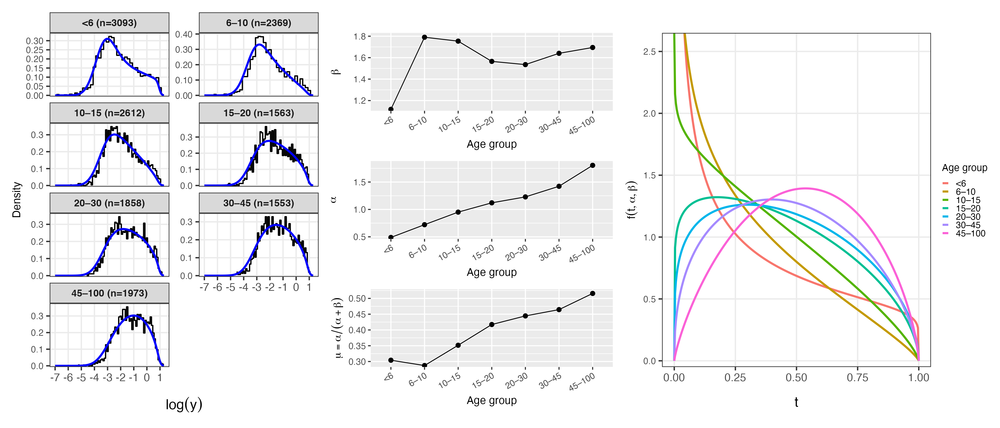{fig-align="center" width="100%"}

::: incremental
- Same three-panel layout as AMA1: histograms, shape parameters, fitted Beta densities
- $\alpha$ rises with age as for AMA1; $\beta$ stabilises after age 10
- Separation between low- and high-response groups weakens more slowly than for AMA1
:::

## MSP1: model specification {.smaller .scrollable}

A **single Beta** throughout, with both shape parameters varying with age:

$$
T \sim \text{Beta}\big(\alpha(a),\,\beta(a)\big),
\qquad
\alpha(a) = \alpha_0\, a^{\gamma},
\qquad
\beta(a) = \beta_0\, a^{\delta(a)}
$$

with a change point $\zeta$ in the exponent of $\beta$:

$$
\delta(a) =
\begin{cases}
\delta_1, & a \le \zeta\\[4pt]
\delta_1+\delta_2, & a > \zeta
\end{cases}
\qquad
\mathbb{E}[T] = \left(1 + \tfrac{\beta_0}{\alpha_0}\, a^{\delta_1+\delta_2-\gamma}\right)^{-1}
$$

::: incremental
- $\hat\gamma = 0.277 > \hat\delta_1 = 0.110$ — $\alpha(a)$ grows faster, so $\mathbb{E}[T]$ rises steadily
- $\hat\zeta = 11.6$ years, $\hat\delta_2 = -0.061 < 0$ — $\beta(a)$ slows, **accelerating** the rise
- Saturation would require $\delta_1+\delta_2 \approx \gamma$; it does not occur here
- Contrast with AMA1: a data-driven rather than mechanistic specification
:::

## MSP profile {.scrollable}

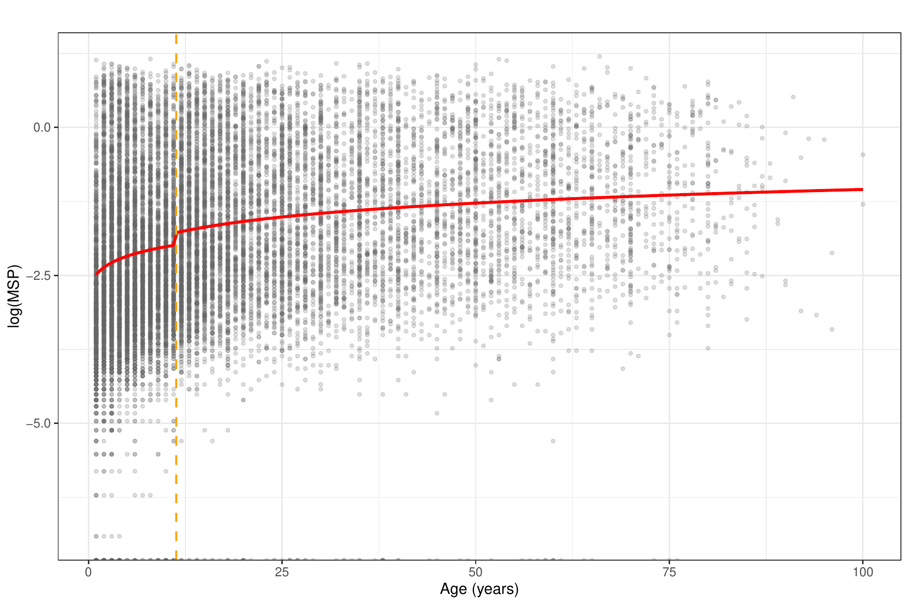{fig-align="center" width="58%"}

## MSP1: goodness of fit {.smaller .scrollable}

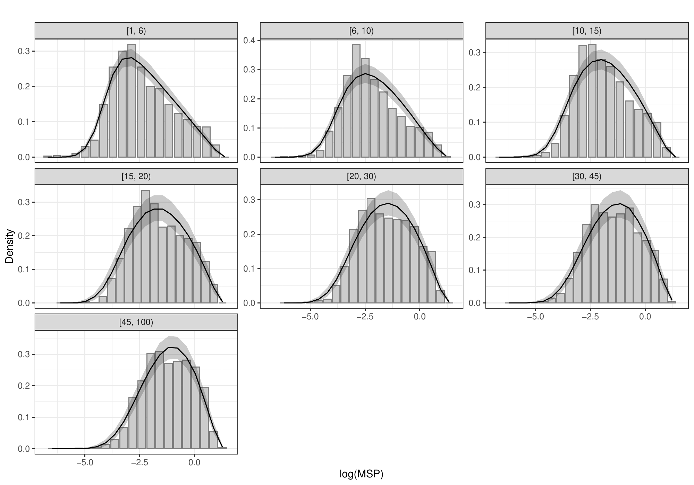{fig-align="center" width="76%"}

::: incremental
- Same envelope comparison as for AMA1
- Model tracks the observed histograms closely across all age bands
- No systematic bias, unlike AMA1's youngest bands
:::

## LBM vs GMM: how much better is the latent model? {.smaller .scrollable}

BIC comparison, age-stratified, both fitted with MLE (positive $\Delta$BIC favours the latent model):

| Antigen | Age band | $\Delta$BIC |
|---|---|---|
| AMA1 | $6$–$10$ | 45 |
| AMA1 | $20$–$30$ | 700 |
| AMA1 | $45+$ | **1394** |
| MSP1 | $<6$ | 42 |
| MSP1 | $20$–$30$ | 259 |
| MSP1 | $45+$ | 459 |

::: incremental
- The latent Beta model **outperforms the GMM in every single age band, for both antigens**
- The advantage for AMA1 grows sharply with age, exceeding 1000 BIC units in older groups
- MSP1 gains are more modest — the GMM adapts reasonably well here, but the latent model still wins throughout
- The $L_2$ histogram approximation reproduces the same ranking as MLE, at a fraction of the computational cost
:::

# Part II {background-color="#073642"}

## Developing a multivariate framework {.smaller .scrollable}

Dependence in multi-antigen serology operates at two levels:

::: incremental
- *Within* an individual — shared infection event, shared immunology
- *Between* individuals — shared exposure environment
:::

 

No existing framework handles cross-antigen correlation, age dependence and spatial dependence together for non-Gaussian, multimodal outcomes.

## Notation for two antigens {.smaller}

For individual $i$ and antigen $k \in \{1,2\}$:

::: incremental
- $\mathbf{Y}_i = (Y_{i,1}, Y_{i,2})^\top$ — the pair of log-antibody concentrations
- $\mathbf{T}_i = (T_{i,1}, T_{i,2})^\top \in (0,1)^2$ — the pair of latent seroreactivities
- $\mathbf{Z}_i = (Z_{i,1}, Z_{i,2})^\top \in \{0,1\}^2$ — component labels, low or high regime per antigen
- $\mathbf{d}_i$ — covariates, with age $a_i$ written separately where it matters
:::

 

The question the principles answer: **where in this hierarchy does each source of dependence belong?**

## P1 — Dependence lies in the latent process {.smaller .scrollable}

::: incremental
- The observation model describes **assay characteristics**, not biology

- Conditional on $\mathbf{T}_i$, the two antibody measurements are **independent**:

  $$
  p(\mathbf{y}_i \mid \mathbf{T}_i = \mathbf{t}) =
  \prod_{k=1}^{2}
  \mathcal{N}\big\{y_{i,k};\, \mu_k(t_{i,k}),\, \sigma_k^2(t_{i,k})\big\}
  $$

- **Implication**: all cross-antigen dependence is carried by the joint density $g(\mathbf{t}\mid\mathbf{d}_i)$ — nothing is left in the observation model

- **When it fails**: antibody cross-reactivity would induce correlation in $\mathbf{Y}$ unrelated to $\mathbf{T}$, requiring a residual covariance term instead
:::

## P2 — Exposure and magnitude are separate {.smaller .scrollable}

::: incremental
- **Exposure** determines the *probability* of mounting a high response

- **Individual immunology** determines the *magnitude*, given exposure

- **Implication**: a mixture for $\mathbf{T}_i$ is the natural choice, since it provides two distinct places to put them

  $$
  \mathbf{T}_i \mid \mathbf{Z}_i = \mathbf{z} \;\sim\;
  \mathcal{N}_{(0,1)^2}\big\{ \mathbf{m}(\mathbf{d}_i;\mathbf{z}),\, \Sigma_T \big\}
  $$

  exposure → the mixing probabilities $\pi_i(\mathbf{z})$;
  magnitude → the component locations $\mathbf{m}(\mathbf{d}_i;\mathbf{z})$

- **Consequence**: spatial variation, being variation in the force of infection, enters only the mixing probabilities
:::

## P3 — Distinct scales, distinct structures {.smaller .scrollable}

::: incremental
- **Shared infection event**, within an individual

  → $\delta(a_i)$ in $\Pr(Z_{i,2}=1 \mid Z_{i,1}=z_1)$, the association between component labels

- **Shared within-host processes**, within an individual

  → $\rho_T$, the correlation in $\Sigma_T$ once the labels are fixed

- **Shared exposure environment**, between individuals

  → $\rho_S$, the cross-correlation of the fields $\{S_1(\mathbf{x}), S_2(\mathbf{x})\}$

 

- **Implication**: each mechanism that induce dependence is governed by its own parameter

:::

## The latent unit square {.smaller .scrollable}

::::: columns
::: {.column width="50%"}
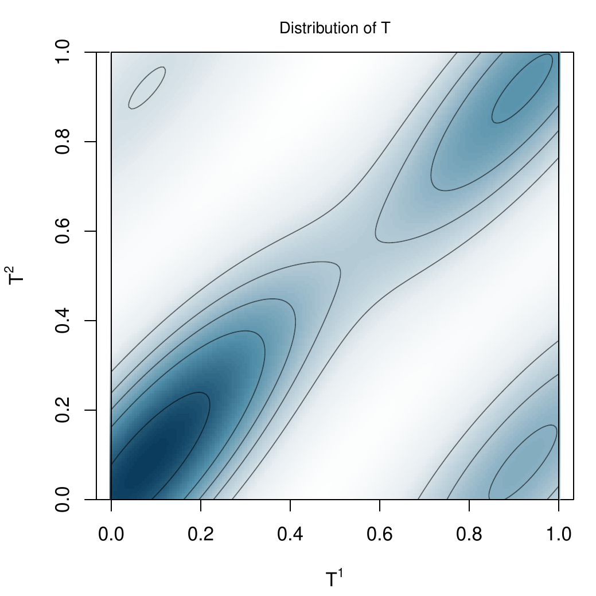
:::
::: {.column width="50%"}
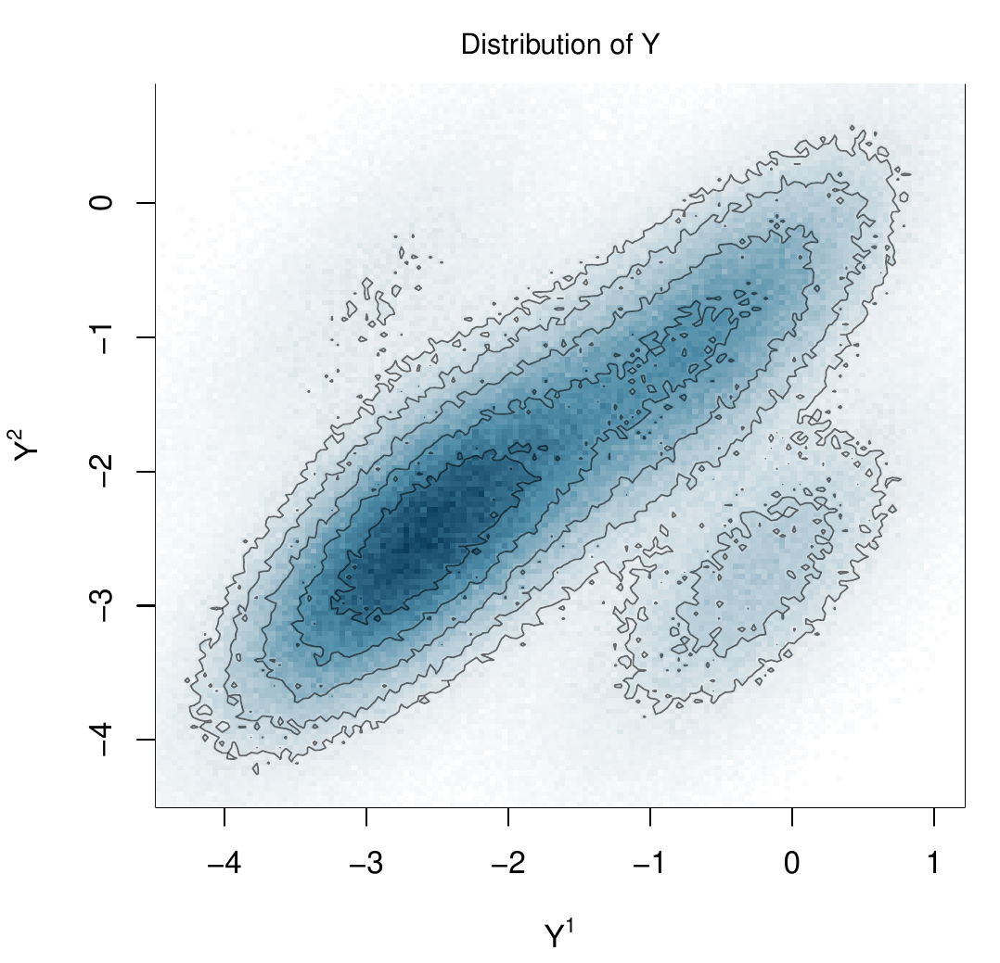
:::
:::::

Mass concentrates on the diagonal, with an off-diagonal tail.

## Correlation between AMA1 and MSP1: Estimates {.smaller .scrollable}

| Quantity | Estimate | 95% CI |
|---|---|---|
| Spatial range, AMA1 | 473 m | (353, 639) |
| Spatial range, MSP1 | 437 m | (318, 577) |
| Cross-field $\rho_S$ | 0.587 | (0.453, 0.711) |
| Within-component $\rho_T$ | 0.717 | (0.691, 0.750) |
| Age effect $\delta_1$ | 0.286 | (0.211, 0.339) |

::: incremental
- Residential-scale clustering of transmission
- Substantial spatial co-localisation of the two antigens
- Cross-antigen association strengthens with age
:::

## Bivariate fit: age-stratified validation

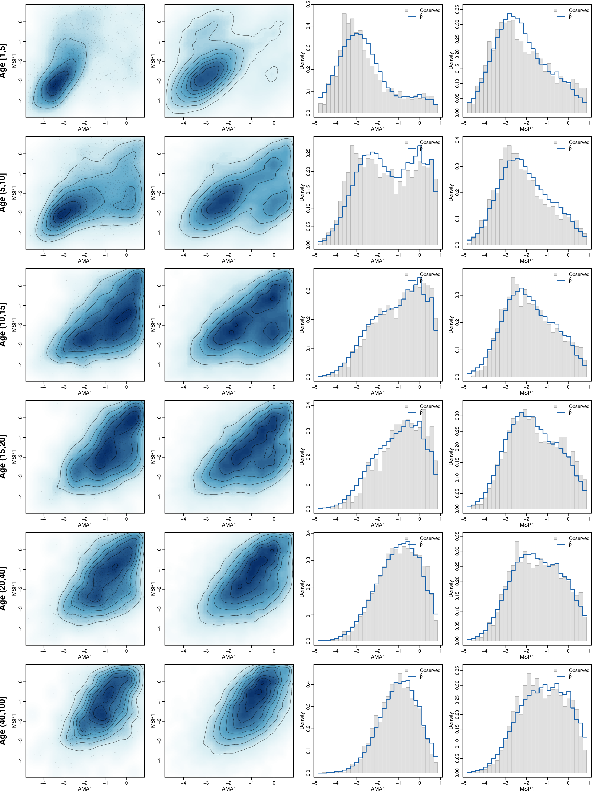{fig-align="center" height="600"}

## Spatial predictions

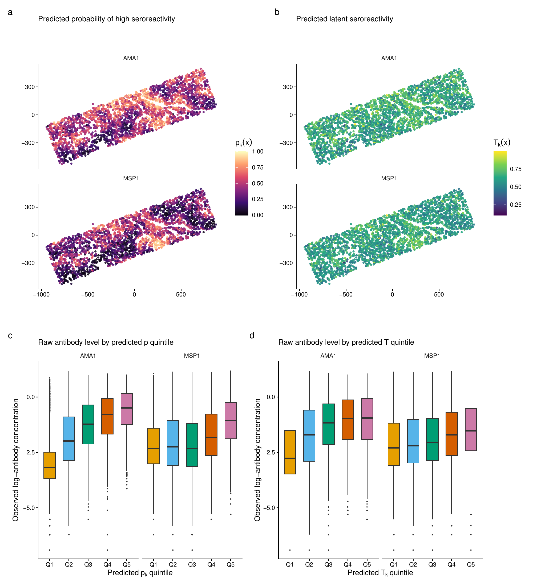{fig-align="center" height="600"}

## Does joint modelling help? {.smaller .scrollable}

Coarsened total variation distance for the **joint** distribution:

| Age band | Univariate | Joint |
|---|---|---|
| $[1,5]$ | 0.295 | **0.189** |
| $(20,40]$ | 0.225 | **0.083** |
| All ages | 0.194 | **0.078** |

::: incremental
- Univariate models stay slightly better on the **marginals** — as expected
- Joint model → 12.6% smaller bivariate HDR at the same coverage
- Simulation: most predictions gains are shown in the inferences for $T$
:::

**Joint modelling matters if we are answering research questions that involve joint properties of antibodies**

## Discussion: going beyond two antigens {.smaller .scrollable}

The sequential construction extends directly by adding conditional terms $\delta_{jk}(a_i)$. The harder questions are epidemiological.

::: incremental
- **Does the pathogen structure matter?** Whether the antigens belong to one pathogen or several has direct implications for how cross-antigen association should be modelled

- **Disease-agnostic approach.** Impose no prior structure on the correlations and let the data determine the full pattern of dependence

- **Assumption-driven approach.** Impose a parsimonious structure informed by biology, for example allowing association only among antigens sharing a pathogen or a transmission route

- **The principles adapt.** **P3** as stated assumes a shared pathogen and life-cycle stage; for antigens from distinct pathogens the shared-infection pathway no longer applies and $\delta(a)$ should be left unconstrained

- **Computation is the binding constraint.** The approximations used here are adequate for a bivariate outcome but unlikely to scale to tens of antibody responses
:::

 

Extending to a handful of antigens from the same pathogen is relatively straightforward. A genuinely multivariate formulation would need to be tailored to the epidemiological context.

## Summary

::: incremental
- Latent seroreactivity provides a flexible and biologically intepretable way to model continuous measurements of antibody concentration
- Three principles keep the multivariate extension interpretable and identifiable
- The gains of joint modelling are dependent on the research question
:::

## THANK YOU! {.smaller}

{height="1.4in"}

**References**

::: {.r-fit-text}
Giorgi, E. and Wallin, J. (2026). A flexible class of latent variable models for the analysis of antibody response data. *Biostatistics*, Volume 27, Issue 1, January 2026, kxag008, [https://doi.org/10.1093/biostatistics/kxag008](https://doi.org/10.1093/biostatistics/kxag008)

Giorgi, E. and Wallin, J. (2026). Bivariate geostatistical latent variable models for the analysis of antibody density data. Pre-print available at [https://arxiv.org/abs/2608.27534](https://arxiv.org/abs/2608.27534)
:::
**Let's Connect**\
🔗 [giorgistat.github.io](https://giorgistat.github.io)\
📧 e.giorgi\@bham.ac.uk\
📍Department of Health Sciences, University of Birmingham, Birmingham, UK

